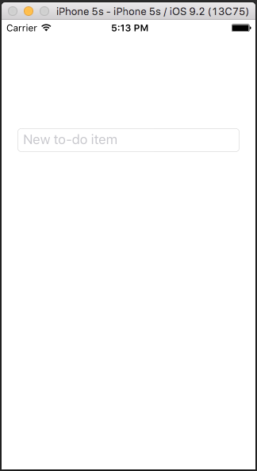
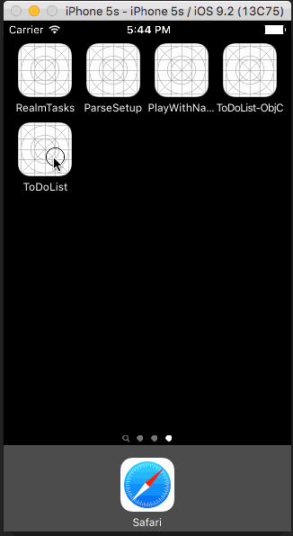
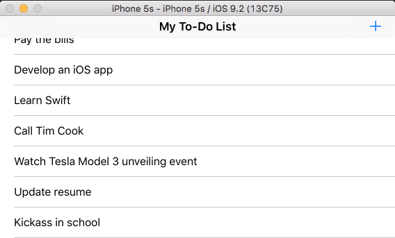
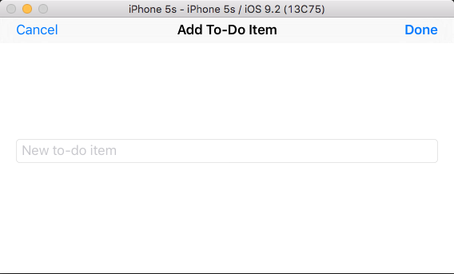
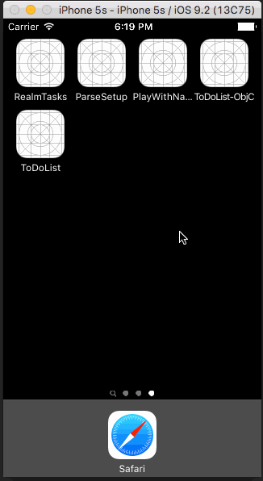

#Start Developing iOS Apps Today

##To-Do-List App / Objective-C / 2013-10-22

[Start Developing iOS Apps Today](Start Developing iOS Apps Today.pdf) is Apple's (Objective-C) tutorial for building your first app —including the tools you need and the major concepts and best practices that will ease your path. (Objective-C is built on top of the C programming language and provides object-oriented capabilities and a dynamic runtime.)

The first three modules each end with a tutorial, where you’ll implement what you’ve learned. At the end of the last tutorial, you’ll have created a simple to-do list app. You can view the code for each tutorial by browsing the commit history of this project.

#Tutorial: Basics
Follow this tutorial to learn the basics of iOS app development, including:

1. How to use Xcode to create and manage a project

2. How to identify the key pieces of an Xcode project

3. How to add standard user interface elements to your app How to build and run your app

###Defining the Concept
**Every great app starts with a concept.**

The best way to arrive at that concept is to consider the problem you want your app to solve. Great apps solve a single, well-defined problem. For example, the Settings app allows users to adjust all of the settings on their device. It provides a single interface for users to accomplish a related set of tasks.

####Here are some key questions to consider when arriving at a concept:
* Who is your audience? 

Your app content and experience will differ depending on whether you’re writing a children’s game, a to-do list app, or even a test app for your own learning.

* What is the purpose of your app? 

It’s important for an app to have a clearly defined purpose. Part of defining the purpose is understanding what one thing will motivate users to use your app.

* What problem is your app trying to solve? 

An app should solve a single problem well instead of trying to offer solutions to multiple distinct problems. If you find that your app is trying to solve unrelated problems, you might consider writing multiple apps.

* What content will your app incorporate? 

Consider what type of content your app will present to users and how they’ll interact with it. Design the user interface to complement the type of content that’s presented in the app.

*An app concept doesn’t have to be completely polished or finished when you start developing your app. Still, it helps to have an idea of where you’re going and what you need to do to get there.*

**Objects** package data with related behavior. **Objects** interact by sending each other messages at runtime. In Objective-C terms, one object sends a message to another object by calling a method on that object.

**Classes Are Blueprints for Objects:** A class describes the behavior and properties common to any particular type of object.

**A protocol defines a set of behavior that’s expected of an object in a given situation.** A protocol comes in the form of a programmatic interface, one that any class may choose to implement. Using protocols, two classes distantly related by inheritance can communicate with each other to accomplish a certain goal, such as parsing XML code or copying an object. Any class that can provide behavior that’s useful to other classes can declare a programmatic interface for vending that behavior anonymously. Any other class can choose to adopt the protocol and implement one or more of its methods, making use of the behavior.

#Tutorial: Storyboards

This tutorial teaches you how to:

1. Adopt Auto Layout to add flexibility to your user interface Use storyboards to define app content and flow

2. Manage multiple view controllers

3. Add actions to elements in your user interface

####When you design your data model, here are some questions to keep in mind:

* What types of data do you need to store? 

Whether you’re storing text, documents, large images, or another type of information, design your data model to handle that particular type of content appropriately.

* What data structures can you use? 

Determine where you can use framework classes and where you need to define classes with custom functionality.

* How will you supply data to the user interface? 

Your model shouldn’t communicate directly with your interface. To handle the interaction between the model and the interface, you’ll need to add logic to your controllers.

**Model-View-Controller (MVC)** is central to a good design for any iOS app. MVC assigns the objects in an app to one of three roles: model, view, or controller. In this pattern, models keep track of your app’s data, views display your user interface and make up the content of an app, and controllers manage your views. 

**Target-action** is a conceptually simple design in which one object sends a message to another object when a specific event occurs. The action message is a selector defined in source code, and the target—the object that receives the message—is an object capable of performing the action, typically a view controller.

**Delegation** is a simple and powerful pattern in which one object in an app acts on behalf of, or in coordination with, another object. The delegating object keeps a reference to the other object—the delegate—and at the appropriate time sends a message to it. The message informs the delegate of an event that the delegating object is about to handle or has just handled. The delegate may respond to the message by updating the appearance (or state) of itself or of other objects in the app, and in some cases it will return a value that affects how an impending event is handled.

#Tutorial: Add Data

This tutorial teaches you how to:

1. Work with common Foundation classes

2. Create custom data classes

3. Implement a delegate and data source protocol Pass data between view controllers

###Taking the ToDoList App to the Next Level

If you do continue with the to-do list app, here are some areas to investigate:

- [ ] Your to-do list disappears when you quit and relaunch the app. You might want to explore ways to make the list persist over time.
- [ ] You’re using the default appearance for all of the controls in your app. UIKit includes features for customizing the appearance of many controls. Explore different user interface options using this technology.
- [x] You’ve given the user a way to add items to the list and mark them as completed, but there’s no facility for deleting items. 

##What's next?

You’ve just learned how to write an app with a simple user interface and basic behavior. At this point, if you are ready to start developing your first full-featured app consider reading the fourth module. It explores the technologies and frameworks you might consider adopting in your next app. 

